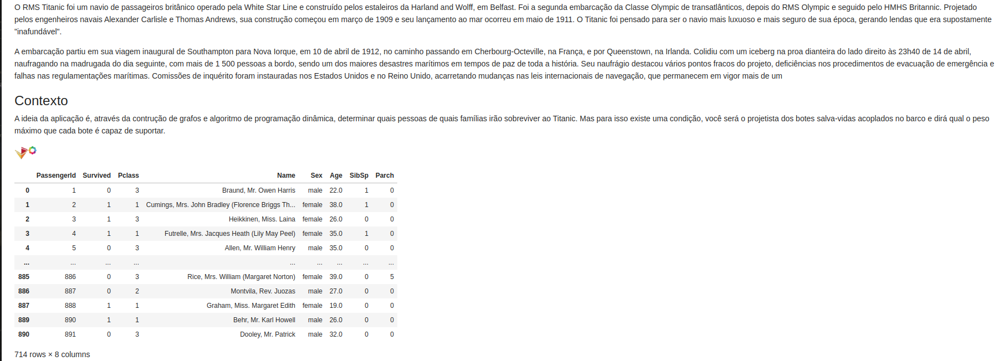
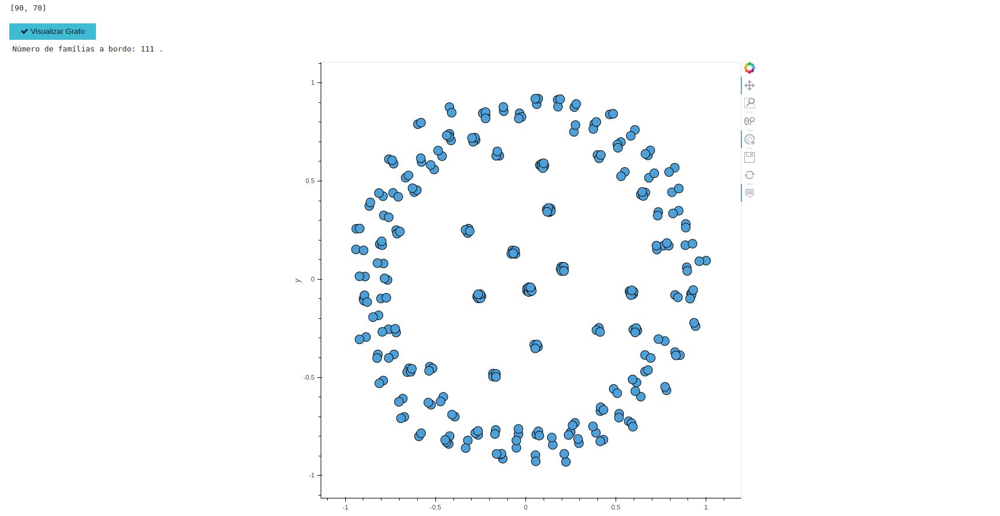
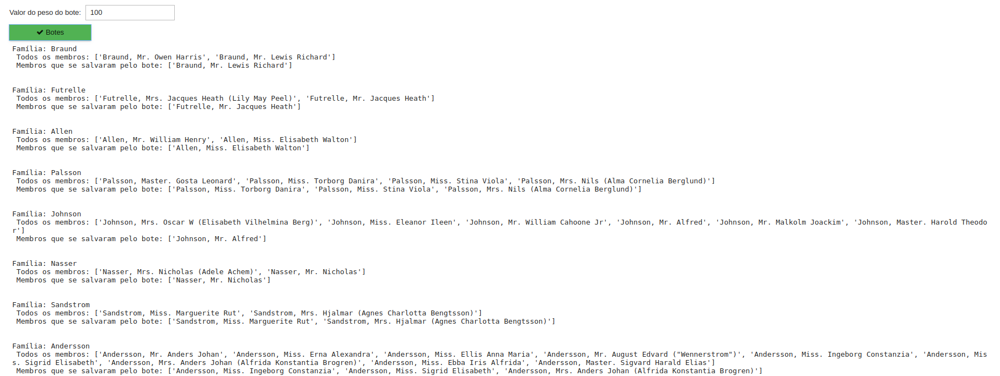

# Titanic


**Número da Lista**: 6<br>
**Conteúdo da Disciplina**: Final<br>

## Alunos
|Matrícula | Aluno |
| -- | -- |
| 17/0138798  |  Caio Fernandes |
| 17/0050939 | Lucas Dutra |

## Sobre
A ideia da aplicação é, através da contrução de grafos e algoritmo de programação dinâmica, determinar quais pessoas de quais famílias irão sobreviver ao Titanic. Mas para isso existe uma condição, você será o projetista dos botes salva-vidas acoplados no barco e dirá qual o peso máximo que cada bote é capaz de suportar.

## Screenshots
### Dado

### Grafo

### Botes



## Instalação 
**Linguagem**: Python<br>

### Requisitos para executar o projeto
1. [Docker](https://docs.docker.com/get-docker/)
2. [Docker-Compose](https://docs.docker.com/compose/install/)

### Executando o projeto
1. Executar o docker-compose (pode necessitar de permissões de administrador)
    ```
        docker-compose up --build
    ```
2. Acesse, por meio de um navegador o seguinte link
    ```
        http://localhost:8888/
    ```

## Uso 
1. Visualize o grafo de famílias;
2. Escolha o valor do peso do bote;
3. Clique no botão "Botes" para obter o resultado.

## Outros 
### Sobre o titanic
O RMS Titanic foi um navio de passageiros britânico operado pela White Star Line e construído pelos estaleiros da Harland and Wolff, em Belfast. Foi a segunda embarcação da Classe Olympic de transatlânticos, depois do RMS Olympic e seguido pelo HMHS Britannic. Projetado pelos engenheiros navais Alexander Carlisle e Thomas Andrews, sua construção começou em março de 1909 e seu lançamento ao mar ocorreu em maio de 1911. O Titanic foi pensado para ser o navio mais luxuoso e mais seguro de sua época, gerando lendas que era supostamente "inafundável".

A embarcação partiu em sua viagem inaugural de Southampton para Nova Iorque, em 10 de abril de 1912, no caminho passando em Cherbourg-Octeville, na França, e por Queenstown, na Irlanda. Colidiu com um iceberg na proa dianteira do lado direito às 23h40 de 14 de abril, naufragando na madrugada do dia seguinte, com mais de 1 500 pessoas a bordo, sendo um dos maiores desastres marítimos em tempos de paz de toda a história. Seu naufrágio destacou vários pontos fracos do projeto, deficiências nos procedimentos de evacuação de emergência e falhas nas regulamentações marítimas. Comissões de inquérito foram instauradas nos Estados Unidos e no Reino Unido, acarretando mudanças nas leis internacionais de navegação, que permanecem em vigor mais de um século depois.
## Sobre o dado
O dado utilizado no projeto é fruto de um pré-processamento tendo como base o dado de uma [competição de predição da plataforma Kaggle](https://www.kaggle.com/c/titanic). Foram utilizadas técnicas de Data Science para gerar as colunas necessárias para usufruimos no contexto da aplicação. 


